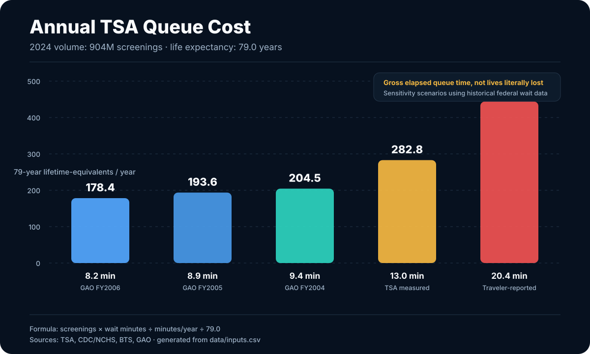
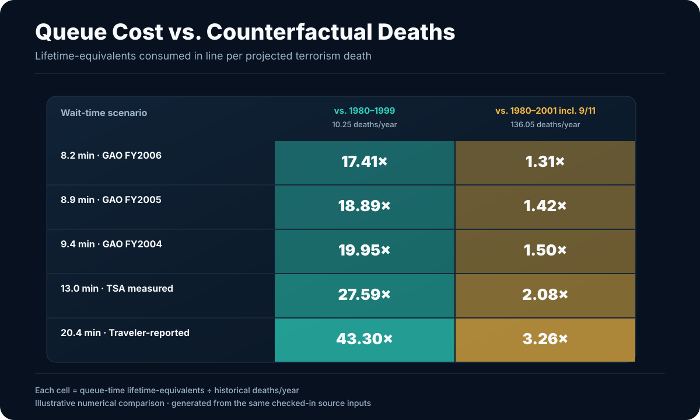
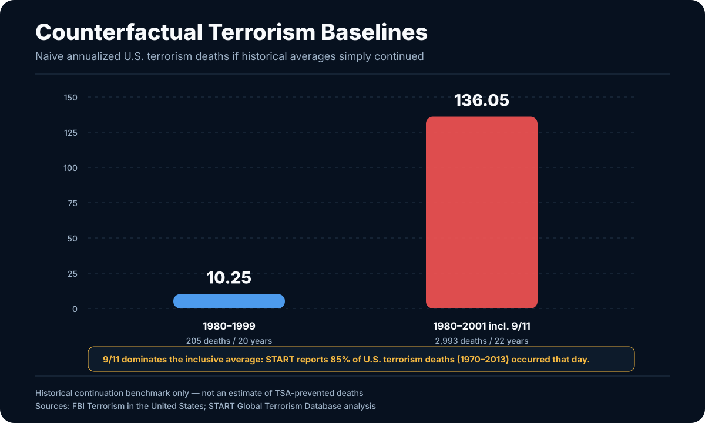
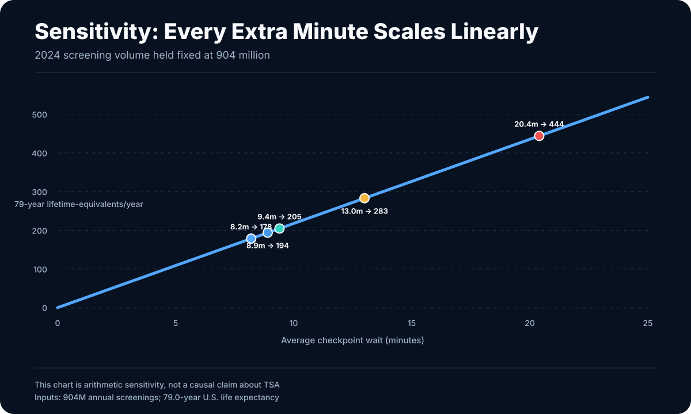

# TSA Body Count

A reproducible counterfactual study comparing the aggregate time Americans spend in TSA checkpoint queues with historical U.S. terrorism-fatality baselines.

The deliberately provocative unit is a **lifetime-equivalent of elapsed time**: total passenger-hours spent waiting divided by U.S. life expectancy. It is **not** a claim that queueing literally kills people.

## The charts









All four SVGs are generated directly from [`data/inputs.csv`](data/inputs.csv). No numbers are manually copied into the charts.

## Headline annualized result

Using TSA's **904 million screenings in 2024** and CDC/NCHS **79.0-year U.S. life expectancy**, available federal wait-time measurements give these sensitivity scenarios:

| Wait-time scenario | Minutes | Person-years/year | 79-year lifetime-equivalents/year | vs. 1980–1999 deaths/year | vs. 1980–2001 incl. 9/11 |
|---|---:|---:|---:|---:|---:|
| GAO FY2006 average peak | 8.2 | 14,094 | 178.4 | 17.41× | 1.31× |
| GAO FY2005 average peak | 8.9 | 15,297 | 193.6 | 18.89× | 1.42× |
| GAO FY2004 average peak | 9.4 | 16,157 | 204.5 | 19.95× | 1.50× |
| TSA Dec 2003–Nov 2004 average peak | 13.0 | 22,344 | 282.8 | 27.59× | 2.08× |
| BTS traveler-reported Dec 2003–Nov 2004 | 20.4 | 35,063 | 443.8 | 43.30× | 3.26× |

These are **sensitivity scenarios**, not a claim that historical wait measurements exactly describe 2024.

## Counterfactual baselines

The FBI recorded **205 terrorism deaths from 1980–1999**, giving a naive continuation baseline of **10.25 deaths/year**. Adding 2000 and 2001 produces **2,993 deaths over 22 years**, or **136.05 deaths/year**. That inclusive average is overwhelmingly driven by 9/11: START reports that 85% of U.S. terrorism deaths from 1970–2013 occurred on that single day.

These numbers are numerical historical-continuation benchmarks, **not estimates of deaths TSA actually prevented**.

## Reproduce everything

Requires Python 3.10+ and no third-party packages.

```bash
make all
```

That regenerates:

- `results/annualized_2024.csv`
- `charts/queue_lifetime_equivalents.svg`
- `charts/ratio_heatmap.svg`
- `charts/counterfactual_baselines.svg`
- `charts/wait_time_sensitivity.svg`

To verify the checked-in artifacts exactly match the source data and generator:

```bash
make check
```

CI performs the same regeneration-and-diff check on every push and pull request.

## Formula

```text
annual_wait_hours = annual_screenings × wait_minutes / 60
annual_wait_years = annual_wait_hours / (24 × 365.2425)
lifetime_equivalents = annual_wait_years / life_expectancy_years
ratio = lifetime_equivalents / historical_terrorism_deaths_per_year
```

## Causal caveat

This currently measures **gross checkpoint queue time**, not time caused by TSA relative to the pre-2001 screening system. Airport screening existed before TSA under airline/private-contractor responsibility. Likewise, the FBI baseline covers all U.S. terrorism, much of which airport checkpoints cannot plausibly prevent. An aviation-only model plus a defensible pre-TSA screening-time baseline is the logical next refinement.

## Primary sources

- [TSA — 2024 screening volume](https://www.tsa.gov/news/press/releases/2025/01/15/tsa-intercepts-6678-firearms-airport-security-checkpoints-2024)
- [CDC/NCHS — Mortality in the United States, 2024](https://www.cdc.gov/nchs/products/databriefs/db548.htm)
- [BTS — Air Passenger Opinions on Security Screening Procedures](https://www.bts.gov/archive/publications/airline_passenger_opinions_on_security_screening_procedures/entire)
- [GAO-07-299 — TSA average peak wait times](https://www.gao.gov/products/gao-07-299)
- [FBI — Terrorism in the United States 1999](https://www.fbi.gov/file-repository/counterterrorism/stats-services-publications-terror_99.pdf/view)
- [FBI — Terrorism 2000/2001](https://www.fbi.gov/file-repository/counterterrorism/stats-services-publications-terror-terror00_01.pdf/view)
- [START — Patterns of Terrorism in the United States, 1970–2013](https://www.start.umd.edu/pubs/START_TEVUS_GTDPatternsofTerrorisminUS1970-2013_Oct2014.pdf)
- [GAO-09-27R — pre-TSA screening structure](https://www.gao.gov/products/gao-09-27r)
- [GAO-17-794 — limits of aviation-security effectiveness measurement](https://www.gao.gov/products/gao-17-794)

## Repository layout

- `data/inputs.csv` — authoritative source values and links
- `model.py` — shared calculations used everywhere
- `analysis.py` — regenerates normalized CSV results
- `generate_charts.py` — generates all SVG charts using only the Python standard library
- `charts/` — generated visualizations embedded above
- `docs/methodology.md` — definitions, limitations, and next steps
