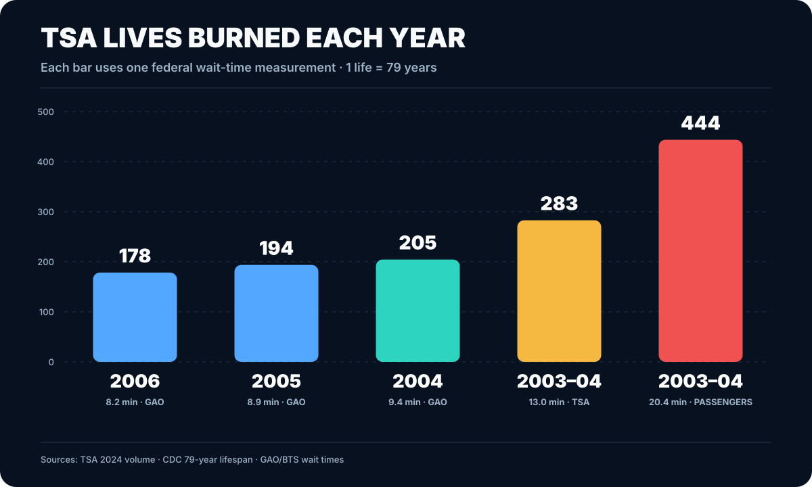
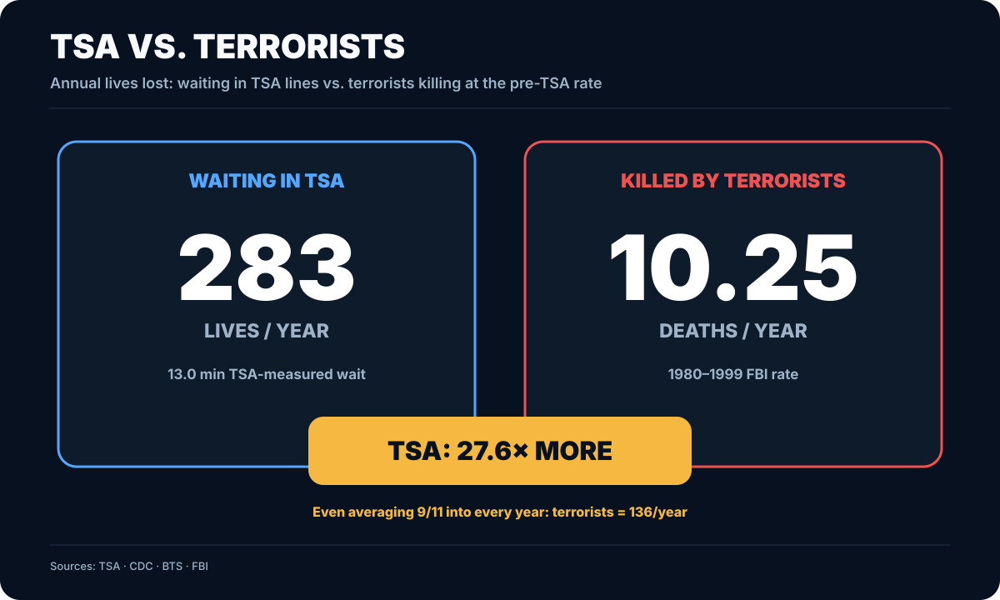
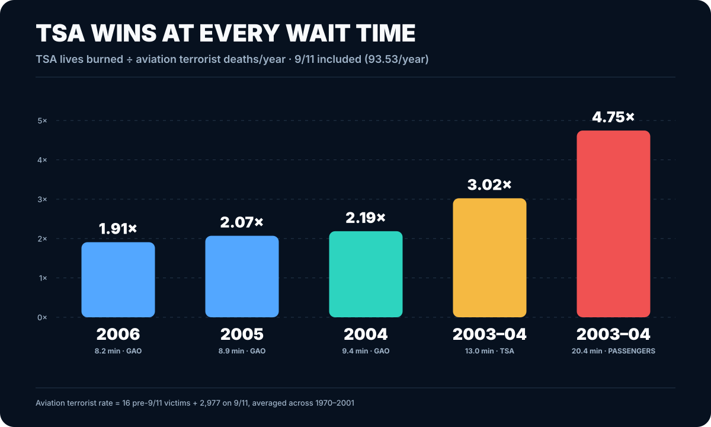
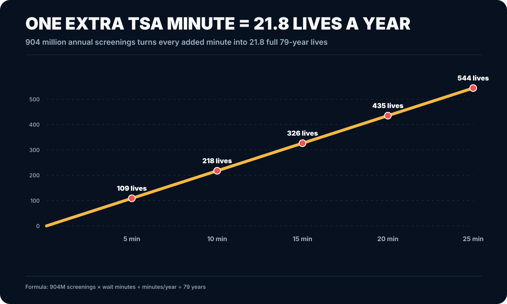

# TSA Body Count

Who wastes more human life: the TSA or terrorists?

Take the time Americans spend standing in TSA lines, divide it by a **79-year human life**, and compare the result with the rate at which terrorists killed people in the United States before TSA existed.

Using TSA's own **13-minute measured wait**, 2024 passenger volume burns **283 lives per year** in line. The FBI's 1980–1999 terrorism death rate is **10.25 people per year**.

**TSA: 27.6× more human life lost.**

Using the **20.4-minute passenger-reported wait**, the TSA body count rises to **444 lives per year — 43.3× the terrorist death rate.**

Even if 9/11 is averaged into every year from 1980–2001, terrorists killed **136.05 people per year**. TSA's 13-minute line still burns **2.08× more lives**.

## TSA lives burned each year

The year under each bar is the year of the federal wait-time measurement. Every bar applies that wait to TSA's 2024 screening volume.



## TSA vs. terrorists

Blue is time lost waiting in TSA lines. Red is people killed by terrorists at the 1980–1999 FBI rate.



## How many times worse is TSA?

Each bar divides TSA's annual body count by the FBI's **10.25 terrorist deaths per year**.



## What one extra minute costs

At 904 million screenings per year, every extra minute in line burns **21.8 full human lives per year**.



## The numbers

| Wait measurement | Wait | Lives burned / year | vs. terrorists |
|---|---:|---:|---:|
| GAO 2006 | 8.2 min | 178 | 17.4× |
| GAO 2005 | 8.9 min | 194 | 18.9× |
| GAO 2004 | 9.4 min | 205 | 20.0× |
| TSA 2003–04 | 13.0 min | 283 | 27.6× |
| Passengers 2003–04 | 20.4 min | 444 | 43.3× |

## Terrorist body count

FBI 1980–1999:

- **205 deaths / 20 years = 10.25 deaths per year**
- **327 incidents / 20 years = 16.35 incidents per year**

Including 2000 and 2001:

- **2,993 deaths / 22 years = 136.05 deaths per year**
- **349 incidents / 22 years = 15.86 incidents per year**

The 9/11 attack accounts for **2,783 of those deaths**. START reports that 9/11 caused **85% of all U.S. terrorism deaths from 1970–2013**.

## Formula

```text
annual_wait_hours = annual_screenings × wait_minutes / 60
annual_wait_years = annual_wait_hours / (24 × 365.2425)
lives_burned = annual_wait_years / 79
ratio_vs_terrorists = lives_burned / 10.25
```

## Reproduce everything

Python 3.10+. No third-party packages.

```bash
make all
```

This regenerates the results CSV and every chart from [`data/inputs.csv`](data/inputs.csv).

```bash
make check
```

`make check` regenerates everything and fails if the committed results or charts differ. GitHub Actions runs the same check on every push and pull request.

## Primary sources

- [TSA — 2024 screening volume](https://www.tsa.gov/news/press/releases/2025/01/15/tsa-intercepts-6678-firearms-airport-security-checkpoints-2024)
- [CDC/NCHS — Mortality in the United States, 2024](https://www.cdc.gov/nchs/products/databriefs/db548.htm)
- [BTS — Air Passenger Opinions on Security Screening Procedures](https://www.bts.gov/archive/publications/airline_passenger_opinions_on_security_screening_procedures/entire)
- [GAO-07-299 — TSA average peak wait times](https://www.gao.gov/products/gao-07-299)
- [FBI — Terrorism in the United States 1999](https://www.fbi.gov/file-repository/counterterrorism/stats-services-publications-terror_99.pdf/view)
- [FBI — Terrorism 2000/2001](https://www.fbi.gov/file-repository/counterterrorism/stats-services-publications-terror-terror00_01.pdf/view)
- [START — Patterns of Terrorism in the United States, 1970–2013](https://www.start.umd.edu/pubs/START_TEVUS_GTDPatternsofTerrorisminUS1970-2013_Oct2014.pdf)

## Repository layout

- `data/inputs.csv` — source values and links
- `model.py` — shared calculations
- `analysis.py` — generates `results/annualized_2024.csv`
- `generate_charts.py` — generates every SVG using only Python's standard library
- `charts/` — generated graphs embedded above
- `docs/methodology.md` — formulas and source definitions
